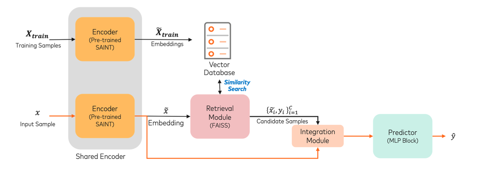

This repository is the official PyTorch implementation of RAFD. Find the paper on (https://doi.org/10.1145/3677052.3698692)

# Retrieval Augmented Fraud Detection (RAFD)




This repository implements a novel approach to financial fraud detection by combining the power of SAINT (Self-Attention and Intersection Neural Network with Transformers) with retrieval-augmented classification techniques. The model addresses critical challenges in fraud detection, particularly the extreme class imbalance and evolving nature of fraudulent patterns.
Architecture
RAFD consists of four main components:

Encoder Module: Utilizes a pre-trained SAINT model as the backbone to generate embeddings for both input samples and training data. SAINT's self-attention mechanisms and contrastive pre-training make it particularly effective for tabular data.

Retrieval Module: Implements efficient similarity search using FAISS (Facebook AI Similarity Search) to find relevant context samples for each input transaction. This module helps enrich the representation of minority class samples.
Integration Module: Combines input embeddings with retrieved context through:

Integration Module: Similarity computation using squared Euclidean distance
Value computation incorporating both feature differences and label information
Weighted aggregation of context information


Predictor Module: A three-layer MLP architecture that makes the final fraud prediction based on the enriched representation.

## Requirements

We recommend using `anaconda` or `miniconda` for python. Our code has been tested with `python=3.8` on linux.

Create a conda environment from the yml file and activate it.
```
conda env create -f saint_environment.yml
conda activate saint_env
```

Make sure the following requirements are met

* torch>=1.8.1
* torchvision>=0.9.1

### Optional
We used wandb to update our logs. But it is optional.
```
conda install -c conda-forge wandb 
```


## Training & Evaluation

In each of our experiments, we use a single Tesla T4 16GB GPU.


To train the model(s) in the paper, run this command:

```
python train.py --dset_id <openml_dataset_id> --task <task_name> --attentiontype <attention_type> 
```

Pretraining is useful when there are few training data samples. Sample code looks like this. (Use train_robust.py file for pretraining and robustness experiments)
```
python train_robust.py --dset_id <openml_dataset_id> --task <task_name> --attentiontype <attention_type>  --pretrain --pt_tasks <pretraining_task_touse> --pt_aug <augmentations_on_data_touse> --ssl_samples <Number_of_labeled_samples>
```


### Arguments
* `--dset_id` : Dataset id from OpenML. Works with all the datasets mentioned in the paper. Works with all OpenML datasets.
* `--task` : The task we want to perform. Pick from 'regression','multiclass', or 'binary'.
* `--attentiontype` : Variant of SAINT. 'col' refers to SAINT-s variant, 'row' is SAINT-i, and 'colrow' refers to SAINT.
* `--embedding_size` : Size of the feature embeddings
* `--transformer_depth` : Depth of the model. Number of stages.
* `--attention_heads` : Number of attention heads in each Attention layer.
* `--cont_embeddings` : Style of embedding continuous data.
* `--pretrain` : To enable pretraining
* `--pt_tasks` : Losses we want to use for pretraining. Multiple arguments can be passed.
* `--pt_aug` : Types of data augmentations used in pretraining. Multiple arguments are allowed. We support only mixup and CutMix right now.
* `--ssl_samples` : Number of labeled samples used in semi-supervised experiments. 
* `--pt_projhead_style` : Projection head style used in contrastive pipeline.
* `--nce_temp` : Temperature used in contrastive loss function.
* `--active_log` : To update the logs onto wandb. This is optional

#### <span style="color:Tomato">Most of the hyperparameters are hardcoded in train.py file. For datasets with really high number of features, we suggest using smaller batchsize, lower embedding dimension and fewer number of heads.</span>


Requirements
bashCopytorch>=1.8.0
faiss-cpu>=1.7.0  # or faiss-gpu for GPU support
numpy>=1.19.0
pandas>=1.2.0
scikit-learn>=0.24.0
Installation
bashCopygit clone https://github.com/[username]/RAFD
cd RAFD
pip install -r requirements.txt
Usage
Data Preparation
The model supports two main datasets:

European Credit Card Default Dataset
IEEE-CIS Fraud Detection Dataset

Data should be organized as follows:
Copydata/
├── european_credit/
│   ├── train.csv
│   ├── valid.csv
│   └── test.csv
└── ieee_cis/
    ├── train.csv
    ├── valid.csv
    └── test.csv
Training
bashCopypython train_rac.py \
    --dset_id 1 \
    --task binary \
    --embedding_size 32 \
    --context_size 60 \
    --epochs 25 \
    --batchsize 256
Key arguments:

dset_id: Dataset identifier (1: European Credit, 2: IEEE-CIS)
context_size: Number of similar samples to retrieve (recommended: 60-120)
embedding_size: Dimension of SAINT embeddings

Model Configuration
The model can be configured through several hyperparameters:
pythonCopymodel = RACModel(
    encoder=encoder_model,
    candidate_embeddings=embds,
    candidate_y=ys,
    search_index=index_wpr,
    n_classes=2,
    d_main=32,
    d_multiplier=1,
    context_size=60
)
Performance
On benchmark datasets, RAFD achieves:

European Credit Card Dataset: 0.833 AUCPR (2.209% improvement over SAINT)
IEEE CIS Dataset: 0.557 AUCPR (1.089% improvement over SAINT)

Key Features

Dynamic Context Enhancement: Automatically enriches minority class representations through relevant sample retrieval
Efficient Similarity Search: Uses FAISS for fast and scalable nearest neighbor search
Flexible Architecture: Can work with different encoder backbones (demonstrated with SAINT)
Interpretable Results: Retrieved samples provide insights into model decisions


## Cite us

```
@article{somepalli2021saint,
  title={SAINT: Improved Neural Networks for Tabular Data via Row Attention and Contrastive Pre-Training},
  author={Somepalli, Gowthami and Goldblum, Micah and Schwarzschild, Avi and Bruss, C Bayan and Goldstein, Tom},
  journal={arXiv preprint arXiv:2106.01342},
  year={2021}
}


Citations and References
This implementation is based on the methodology described in the following paper:
bibtexCopy@inproceedings{long2022retrieval,
  title={Retrieval Augmented Classification for Long-Tail Visual Recognition},
  author={Long, Alexander and Yin, Wei and Ajanthan, Thalaiyasingam and Nguyen, Vu and Purkait, Pulak and Garg, Ravi and Blair, Alan and Shen, Chunhua and van den Hengel, Anton},
  booktitle={IEEE/CVF Conference on Computer Vision and Pattern Recognition (CVPR)},
  pages={6949--6959},
  year={2022}
}
If you use this implementation in your work, please cite both the original RAC paper above and this repository:
bibtexCopy@software{rafd2024,
  title={Retrieval Augmented Fraud Detection (RAFD)},
  author={[Your Name]},
  year={2024},
  url={https://github.com/[username]/RAFD}
}
Acknowledgments
This implementation builds upon:

The Retrieval Augmented Classification (RAC) methodology introduced by Long et al. in their CVPR 2022 paper
SAINT (Self-Attention and Intersection Neural Network with Transformers) encoder architecture for tabular data, developed by Somepalli et al.
FAISS (Facebook AI Similarity Search) library for efficient similarity search
The implementation adapts the RAC approach from computer vision to the domain of fraud detection, demonstrating its effectiveness in handling class imbalance in financial data

```
